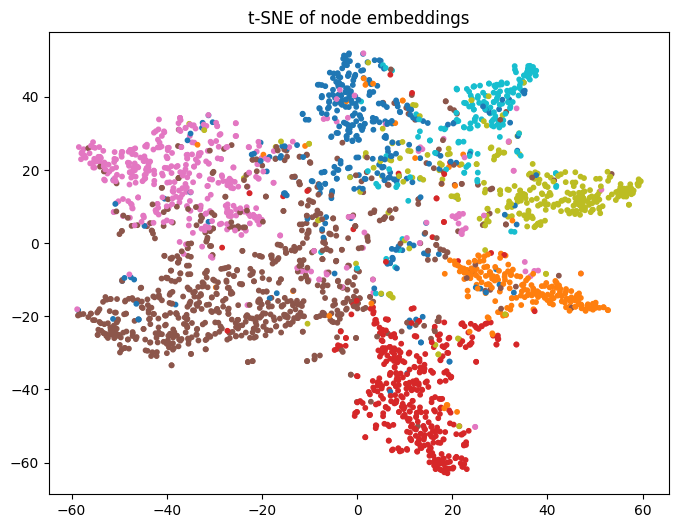
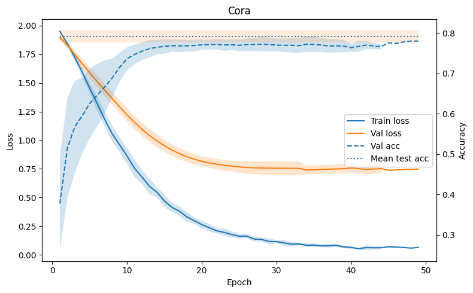
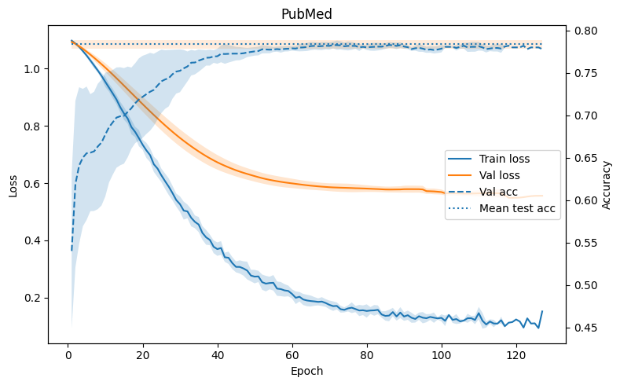
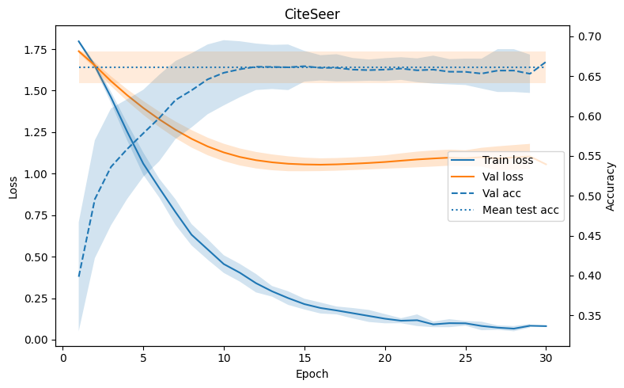
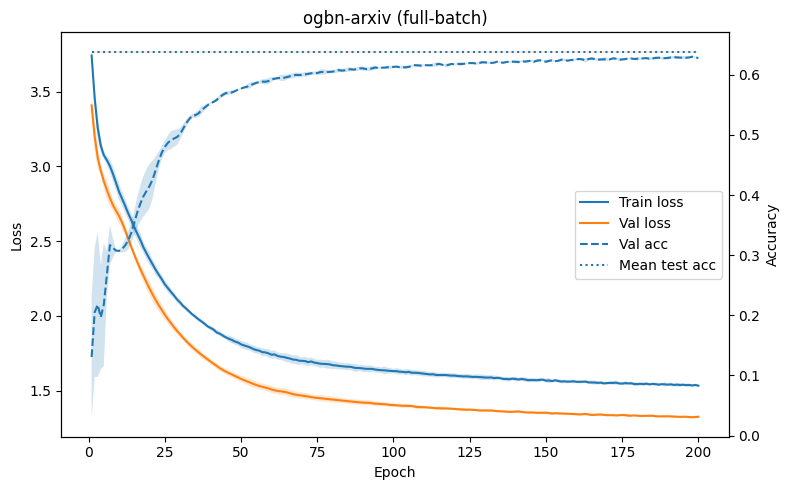
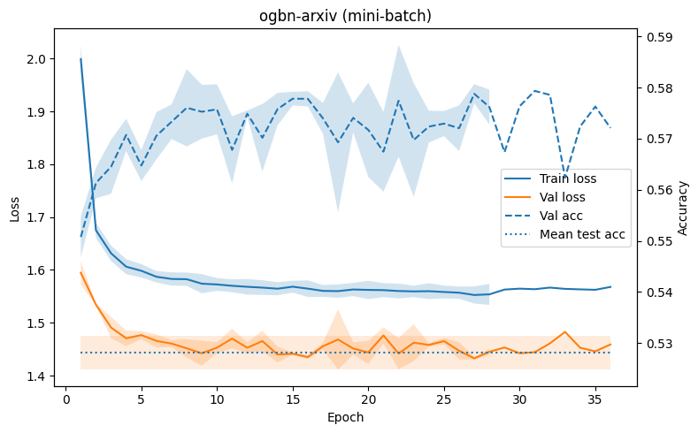

# Title
Convolutions are a simple yet powerful technique to maximize computing efficiency when it comes to many types of data. For graphs however, this technique is not so easy to apply as it is quite hard to determine where exactly we are in a graph, where we are moving and what neighbors to include in the convolution; which  are all important information we need to calculate the convolution. Therefore, previous methods used sepctral theory, eigenvalues, eigenvectors and fourier transforms, denoted by $g_{0}\star x = U g_\theta U^T x$ where x is the signal, U is the matrix of eigenvectors of the normalized Laplacian L and $g_\theta$ is the filter in the fourier domain. $U^Tx$ transforms the signal x to fourier domain, then the convolution is applied through mulitplication with the kernel $g_\theta$ and the transformed signal is send back to time domain by multiplication with U. The use of eigenvalues/vectors comes with the price of high compute of $O(N^2)$ to $O(N^3)$. 

As part of a recent deep learning class we implemented the well-known GCN architecture proposed by Kipf and Welling in their paper "Semi-supervised classification with graph convolutional networks", this repo wraps up our project.

## 1) Context / Key-concepts
Kipf and Welling simplified this spectral formulation using a first-order approximation (k=1 and $\lambda_{max} =2$) of Chebyshev polynomials, reducing the complexity to $O(|\mathcal{E}|)$. Combined with the renormalization trick, this yields the well-known propagation rule:

$H^{(l+1)} = \sigma(\tilde{D}^{-1/2}\tilde{A}\tilde{D}^{-1/2}H^lW^l) = \sigma(\hat{A}H^lW^l)$,
 
where $\tilde{A} = A + I$ adds self-loops, $\tilde{D}$ is the corresponding degree matrix, and $\hat{A}$ denotes the normalized adjacency matrix. The normalization prevents feature magnitudes from growing uncontrollably and reduces the dominance of high-degree nodes during aggregation. Self-loops are important because they allow each node to preserve and propagate its own features in addition to information received from its neighbors.

## 2) Implementation details

The normalization prevents feature magnitudes from growing uncontrollably and reduces the dominance of high-degree nodes during aggregation. Self-loops are important because they allow each node to preserve and propagate its own features in addition to information received from its neighbors. Each layer therefore follows the above mentioned propagation rule, with ReLU activation after the first layer and dropout applied between the two layers.

In addition to the full-batch approach of Kipf and Welling, a mini-batch variant was implemented to compare runtime and scalability on larger datasets. While the original model is designed for full-batch training on citation graphs such as Cora, the mini-batch version was added to investigate how the training behavior changes once the graph becomes too large for an efficient full-graph forward pass. 

While the original Kipf-Welling model is designed for full-batch training on citation graphs such as Cora, the mini-batch version was added to investigate how the training behavior changes once the graph becomes too large for an efficient full-graph forward pass.

Dataset statistics

| Dataset         | Type        | Nodes       | Edges        | Classes | Features | Label rate |
|-----------------|-------------|------------|---------------|---------|----------|------------|
| CiteSeer        | Citation network | 3,327    | 9,104      |6   | 3,703   | 0.036  |
| Cora            | Citation network | 2,708    | 10,556      | 7  | 1,433   | 0.052  |
| PubMed          | Citation network | 19,717   | 88,648     | 3  | 500     | 0.003  |
| ogbn-arxiv      | Citation network | 169,343   | 1,166,243 | 40 |  128    | 0.537  |
| ogbn-products   | Product co-puchasing network | 2,449,029 | 61,859,140   | 47 | 100  |0.080  |


Like Kipf and Welling, undirected graphs were used (means: edge information, if available, was not used) and the main task was node classification. 


## 3) Results

To ensure comparability, for all runs the same standard NVIDIA L4 GPU with 24 GB GDDR6 was used.

Basically, 2 experiment settings were run: 1) implementation of the Kipf and Welling architecture & comparison of results and 2) the comparison of the added mini-batch and full-batch approach & its impact on runtime.

Furthermore, t-SNE was used to display the final node embeddings of the second layer of the GCN for the Cora dataset. The result shows quite good seperation between classes, with only minor overlap. With an average test accuracy of around 80% this is roughly what could be expected.


### 3.1) Implementation of the architecture proposed by Kipf and Welling 2017

| Metrics         | Cora   | PubMed       | CiteSeer     |
|-----------------|---------|------------|----------------|
| test acc (std over 9 runs)           | 79.2 ($\pm0.05$) | 78.39 ($\pm0.5$) | 66.7 ($\pm1.9$)  |
| test acc Kipf & Welling  | 81.5       | 79.0          | 70.3     |
| test acc difference      | 2.3        | 0.61          | 3.3      |
| mean epoch total time    | 0.0015s    | 0.0017        | 0.0011s  |
| mean total train time    | 0.1022     | 0.1900s       |  0.0429  |

Across all three datasets, the GCN converges quickly in the first epochs: training loss decreases steadily, validation loss drops early and then plateaus, and validation accuracy rises rapidly before stabilizing. The gap between training and validation loss becomes more pronounced over time, indicating mild overfitting, but early stopping prevents stronger degradation. Test accuracy remains close to the final validation accuracy on all datasets, suggesting that the selected models generalize reasonably well. Overall, the training dynamics are stable and consistent across Cora, PubMed, and CiteSeer, with PubMed achieving the strongest performance and CiteSeer appearing the most challenging. 

The obtained metrics (except for runtime) are close to the values reported by Kipf and Welling, however, it was not possible to beat.At the same time, their paper reports single values only, whereas the results presented here are averaged over multiple runs and complemented by confidence intervals. The comparison should therefore be interpreted with some caution, since the values reported in this work explicitly reflect variability across random seeds and thus provide a more robust picture of performance.





### 3.2) Mini-batch vs. full-batch and implications for runtime on larger graphs 

| Metrics         | Cora + full-batch   | Cora + mini-batch | ogbn-arxiv + full-batch| ogbn-arxiv + mini-batch |
|-----------------|---------------------|----------------|--------------------------|-------------------------|
| mean epoch runtime | 0.0015s    | 0.0061s   | 0.0242s | 0.8268s |
| test acc (mean over 3 runs) | 79.31    | 79.18  |  63.85 |  52.8 |




On ogbn-arxiv, full-batch clearly remains superior in this setup. It achieves a mean test accuracy of 0.6385, compared to 0.5281 for the mini-batch variant, while also being much faster per epoch (0.024s vs. 0.827s). This is consistent with the training curves above: full-batch converges more smoothly and to a better optimum, whereas mini-batch shows noisier validation behavior and lower final performance. In other words, this graph is still not large enough for mini-batch training to become advantageous on our hardware. With 24 GB of GPU memory, full-batch training on ogbn-arxiv is still easily feasible and even substantially more efficient. The next natural step is therefore to move to a much larger graph, where full-batch training is expected to approach its memory and runtime limits and the practical benefit of mini-batch training should become more apparent.

tbd: ogbn-products

## Project structure

```
repo-name/
├── README.md
├── requirements.txt                 
├── src/
│   ├── model.py                   
│   ├── train.py                
│   ├── data_utils.py              
├── data/
│   └── Planetoid
│   └── ogbn_arxiv                
├── notebooks/
│   └── experiments.ipynb  
├── configs/
│   └── default_config.yaml
│   └── citeseer.yaml
│   └── pubmed.yaml   
│   └── ogbn_arxiv_full_batch.yaml
│   └── pubmed_config_mini_batch.yaml
├── results/
    └── ... 
```

## How to run

Main packages used in this project:
- PyTorch
- PyTorch Geometric
- Pyg-lib
- NumPy
- SciPy
- PyYAML

Pyg-lib was used to obtain the subgraphs for the mini-batch approach. However, the pyg-lib package is only compatible with no later version of torch then 2.8.0 and cu128. Install the ground packages via: 

`pip install -r requirements.txt`

and manually install pyg-lib (assumung torch 2.8.0 and cuda cu128) with:

`pip install pyg-lib -f https://data.pyg.org/whl/torch-2.8.0+cu128.html`

Run default experiment:

`python src/train.py --config configs/default_config.yaml`

To run different hyperparameter setup, a new config.yaml file must be created and specified after the --config flag.

## References

Kipf, T. N., & Welling, M. (2016). Semi-supervised classification with graph convolutional networks. arXiv preprint arXiv:1609.02907.